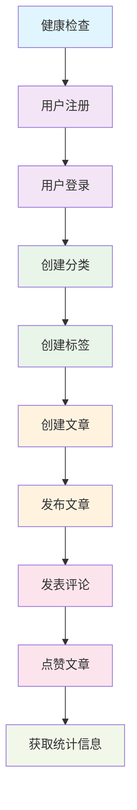
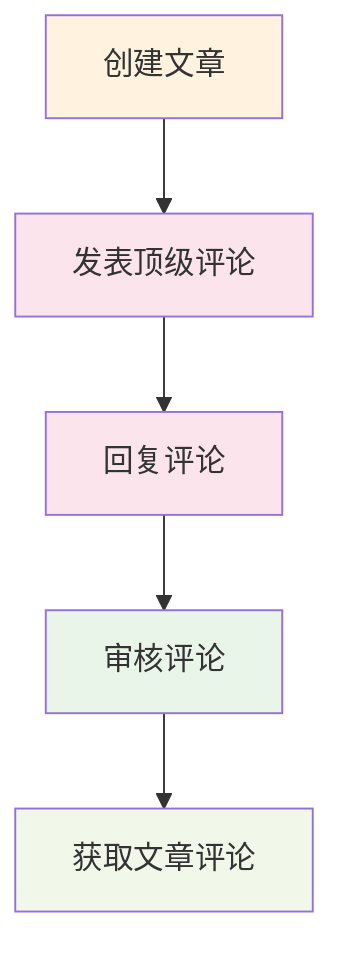
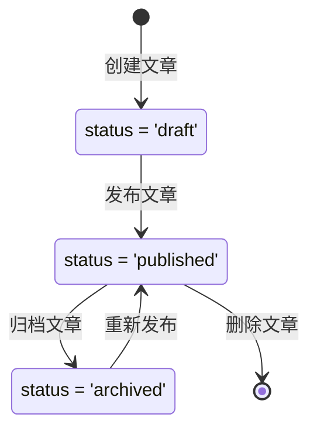

# 博客系统 Postman API 测试指南 🚀

## 📋 目录
- [导入Postman集合](#导入postman集合)
- [环境变量配置](#环境变量配置)
- [API测试流程](#api测试流程)
- [常见测试场景](#常见测试场景)
- [错误处理说明](#错误处理说明)
- [高级测试技巧](#高级测试技巧)

---

## 📥 导入Postman集合

### 1. 导入集合文件
1. 打开 Postman 应用
2. 点击左上角 **Import** 按钮
3. 选择 **File** 选项卡
4. 上传 `Blog_System_API.postman_collection.json` 文件
5. 点击 **Import** 完成导入

### 2. 集合结构说明
导入后您将看到以下API分组：

```
📁 博客系统 API 接口集合
├── 🏥 系统健康检查
│   └── 健康检查
├── 👤 用户管理
│   ├── 用户注册
│   ├── 用户登录
│   ├── 获取用户信息
│   └── 更新用户资料
├── 📝 文章管理
│   ├── 获取文章列表
│   ├── 根据ID获取文章
│   ├── 根据Slug获取文章
│   ├── 创建文章
│   ├── 更新文章
│   ├── 删除文章
│   ├── 发布文章
│   ├── 点赞文章
│   └── 取消点赞文章
├── 💬 评论管理
│   ├── 获取文章评论
│   ├── 创建评论
│   ├── 回复评论
│   ├── 审核通过评论
│   └── 拒绝评论
├── 📂 分类管理
│   ├── 获取分类列表
│   ├── 根据Slug获取分类
│   └── 创建分类
├── 🏷️ 标签管理
│   ├── 获取标签列表
│   ├── 获取热门标签
│   └── 创建标签
├── 📊 统计信息
│   ├── 获取统计概览
│   └── 获取热门文章
└── 📖 API文档
    └── 获取API文档
```

---

## ⚙️ 环境变量配置

### 1. 创建环境
1. 点击右上角的齿轮图标 ⚙️
2. 选择 **Manage Environments**
3. 点击 **Add** 创建新环境
4. 命名为 `Blog System Local`

### 2. 配置环境变量
添加以下环境变量：

| 变量名 | 初始值 | 当前值 | 描述 |
|--------|--------|--------|------|
| `base_url` | `http://localhost:8080` | `http://localhost:8080` | API基础URL |
| `user_id` | `1` | `1` | 测试用户ID |
| `post_id` | `1` | `1` | 测试文章ID |
| `post_slug` | `my-first-blog-post` | `my-first-blog-post` | 测试文章Slug |
| `comment_id` | `1` | `1` | 测试评论ID |
| `category_slug` | `tech-share` | `tech-share` | 测试分类Slug |
| `auth_token` | `` | `` | 用户认证Token（登录后获取） |

### 3. 激活环境
在右上角的环境下拉菜单中选择 `Blog System Local`

---

## 🧪 API测试流程

### 阶段1: 系统检查 🏥

#### 1.1 健康检查
```http
GET {{base_url}}/health
```
**预期响应**:
```json
{
  "status": "ok",
  "message": "Blog system is running"
}
```

### 阶段2: 用户管理 👤

#### 2.1 用户注册
```http
POST {{base_url}}/api/users/register
Content-Type: application/json

{
  "username": "testuser",
  "email": "test@example.com",
  "password": "123456",
  "nickname": "测试用户"
}
```

#### 2.2 用户登录
```http
POST {{base_url}}/api/users/login
Content-Type: application/json

{
  "email": "test@example.com",
  "password": "123456"
}
```
**重要**: 保存响应中的 `token` 到环境变量 `auth_token`

#### 2.3 获取用户信息
```http
GET {{base_url}}/api/users/{{user_id}}
```

#### 2.4 更新用户资料
```http
PUT {{base_url}}/api/users/{{user_id}}/profile
Content-Type: application/json

{
  "bio": "这是我的个人简介",
  "website": "https://example.com",
  "location": "北京",
  "gender": "male"
}
```

### 阶段3: 内容管理 📝

#### 3.1 创建分类
```http
POST {{base_url}}/api/categories
Content-Type: application/json

{
  "name": "技术分享",
  "slug": "tech-share",
  "description": "技术相关的文章分类",
  "color": "#007bff",
  "icon": "tech",
  "sort_order": 1
}
```

#### 3.2 创建标签
```http
POST {{base_url}}/api/tags
Content-Type: application/json

{
  "name": "Go语言",
  "slug": "golang",
  "color": "#00ADD8"
}
```

#### 3.3 创建文章
```http
POST {{base_url}}/api/posts
Content-Type: application/json

{
  "title": "我的第一篇博客文章",
  "content": "这是文章的详细内容，支持Markdown格式...",
  "excerpt": "这是文章摘要",
  "slug": "my-first-blog-post",
  "author_id": 1,
  "category_id": 1,
  "tags": [1, 2, 3],
  "status": "draft"
}
```

#### 3.4 发布文章
```http
POST {{base_url}}/api/posts/{{post_id}}/publish
```

#### 3.5 获取文章列表
```http
GET {{base_url}}/api/posts?page=1&limit=10&status=published
```

### 阶段4: 互动功能 💬

#### 4.1 发表评论
```http
POST {{base_url}}/api/comments
Content-Type: application/json

{
  "content": "这是一条评论内容",
  "post_id": 1,
  "user_id": 1,
  "parent_id": null
}
```

#### 4.2 回复评论
```http
POST {{base_url}}/api/comments
Content-Type: application/json

{
  "content": "这是对评论的回复",
  "post_id": 1,
  "user_id": 2,
  "parent_id": 1
}
```

#### 4.3 点赞文章
```http
POST {{base_url}}/api/posts/{{post_id}}/like
Content-Type: application/json

{
  "user_id": 1
}
```

---

## 🎯 常见测试场景

### 场景1: 完整用户流程测试



**执行顺序**:
1. 🏥 健康检查
2. 👤 用户注册 → 用户登录
3. 📂 创建分类
4. 🏷️ 创建标签
5. 📝 创建文章 → 发布文章
6. 💬 发表评论
7. ❤️ 点赞文章
8. 📊 获取统计信息

### 场景2: 评论系统测试



### 场景3: 文章生命周期测试



---

## ❌ 错误处理说明

### 常见HTTP状态码

| 状态码 | 含义 | 常见原因 | 解决方案 |
|--------|------|----------|----------|
| `200` | 成功 | 请求处理成功 | - |
| `201` | 创建成功 | 资源创建成功 | - |
| `400` | 请求错误 | 参数验证失败 | 检查请求参数格式和必填字段 |
| `401` | 未授权 | 认证失败 | 检查Token是否有效 |
| `404` | 资源不存在 | 请求的资源不存在 | 检查ID或Slug是否正确 |
| `409` | 冲突 | 资源已存在 | 检查唯一性字段（如用户名、邮箱） |
| `500` | 服务器错误 | 内部服务器错误 | 检查服务器日志 |

### 典型错误响应格式

```json
{
  "error": "用户名或邮箱已存在"
}
```

### 参数验证错误示例

```json
{
  "error": "Key: 'User.Username' Error:Field validation for 'Username' failed on the 'required' tag"
}
```

---

## 🔧 高级测试技巧

### 1. 使用Pre-request Scripts

在请求前自动设置变量：

```javascript
// 生成随机用户名
pm.environment.set("random_username", "user_" + Math.random().toString(36).substr(2, 9));

// 生成随机邮箱
pm.environment.set("random_email", "test_" + Math.random().toString(36).substr(2, 9) + "@example.com");

// 设置当前时间戳
pm.environment.set("timestamp", new Date().getTime());
```

### 2. 使用Tests脚本

自动验证响应和提取数据：

```javascript
// 验证状态码
pm.test("Status code is 200", function () {
    pm.response.to.have.status(200);
});

// 验证响应时间
pm.test("Response time is less than 200ms", function () {
    pm.expect(pm.response.responseTime).to.be.below(200);
});

// 提取用户ID
if (pm.response.code === 201) {
    const responseJson = pm.response.json();
    pm.environment.set("user_id", responseJson.user.id);
}

// 提取认证Token
if (pm.response.code === 200) {
    const responseJson = pm.response.json();
    if (responseJson.token) {
        pm.environment.set("auth_token", responseJson.token);
    }
}
```

### 3. 批量测试运行

#### 使用Collection Runner
1. 点击集合右侧的 **▶️** 按钮
2. 选择要运行的请求
3. 设置迭代次数和延迟
4. 点击 **Run** 开始批量测试

#### 使用Newman命令行
```bash
# 安装Newman
npm install -g newman

# 运行测试集合
newman run Blog_System_API.postman_collection.json \
  --environment Blog_System_Local.postman_environment.json \
  --reporters html,cli \
  --reporter-html-export report.html
```

### 4. 数据驱动测试

创建CSV文件 `test_data.csv`：
```csv
username,email,password
testuser1,test1@example.com,123456
testuser2,test2@example.com,123456
testuser3,test3@example.com,123456
```

在Collection Runner中上传CSV文件进行批量测试。

---

## 📊 测试报告

### 生成HTML报告

使用Newman生成详细的HTML测试报告：

```bash
newman run Blog_System_API.postman_collection.json \
  --environment Blog_System_Local.postman_environment.json \
  --reporters htmlextra \
  --reporter-htmlextra-export report.html \
  --reporter-htmlextra-darkTheme
```

### 集成CI/CD

在GitHub Actions中集成API测试：

```yaml
name: API Tests
on: [push, pull_request]

jobs:
  test:
    runs-on: ubuntu-latest
    steps:
      - uses: actions/checkout@v2
      - name: Install Newman
        run: npm install -g newman
      - name: Run API Tests
        run: |
          newman run docs/Blog_System_API.postman_collection.json \
            --reporters cli,junit \
            --reporter-junit-export results.xml
      - name: Publish Test Results
        uses: EnricoMi/publish-unit-test-result-action@v1
        if: always()
        with:
          files: results.xml
```

---

## 🎉 总结

通过这个Postman集合，您可以：

✅ **完整测试博客系统的所有API接口**  
✅ **验证用户注册、登录、文章管理等核心功能**  
✅ **测试评论系统和点赞功能**  
✅ **验证数据库关系和约束**  
✅ **进行性能和压力测试**  
✅ **生成详细的测试报告**  

### 快速开始步骤
1. 🚀 启动博客系统服务 (`go run main.go`)
2. 📥 导入Postman集合文件
3. ⚙️ 配置环境变量
4. 🧪 按照测试流程执行API调用
5. 📊 查看测试结果和响应数据

祝您测试愉快！🎊