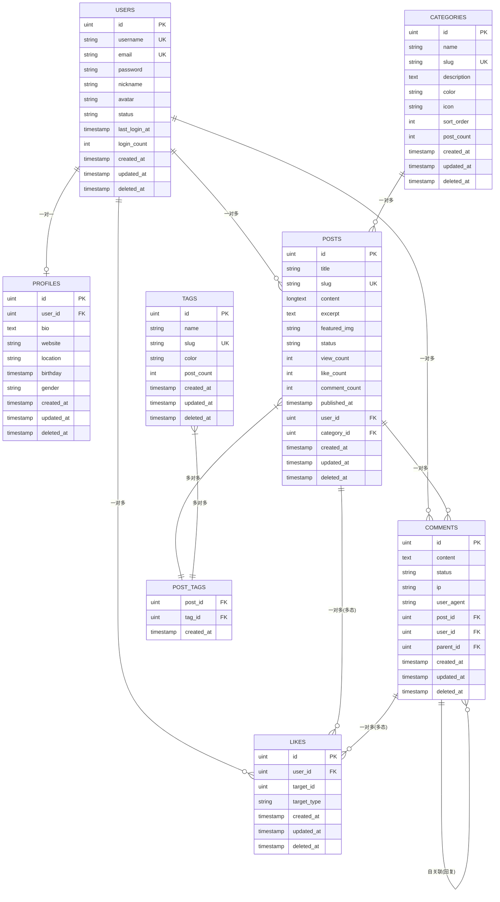
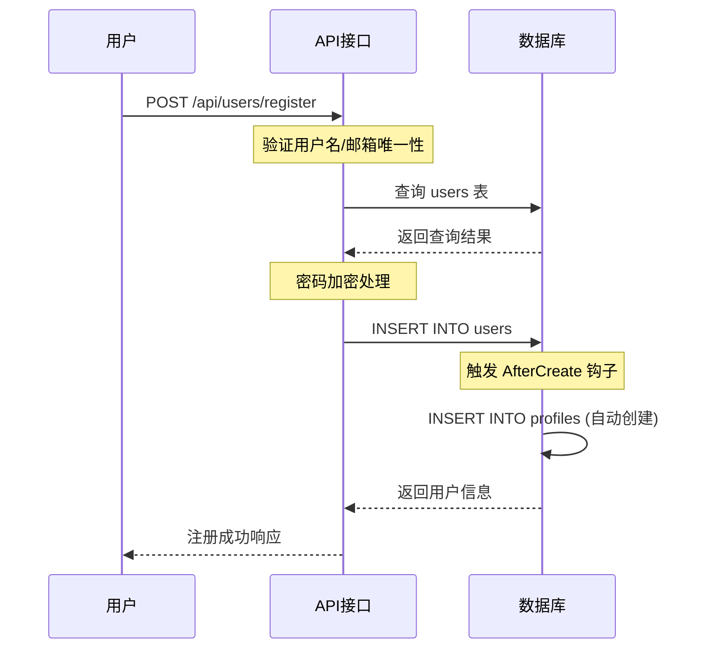
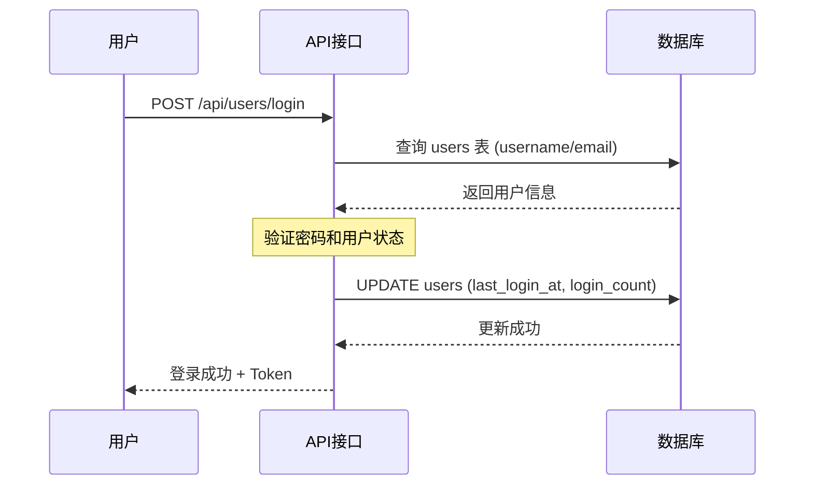
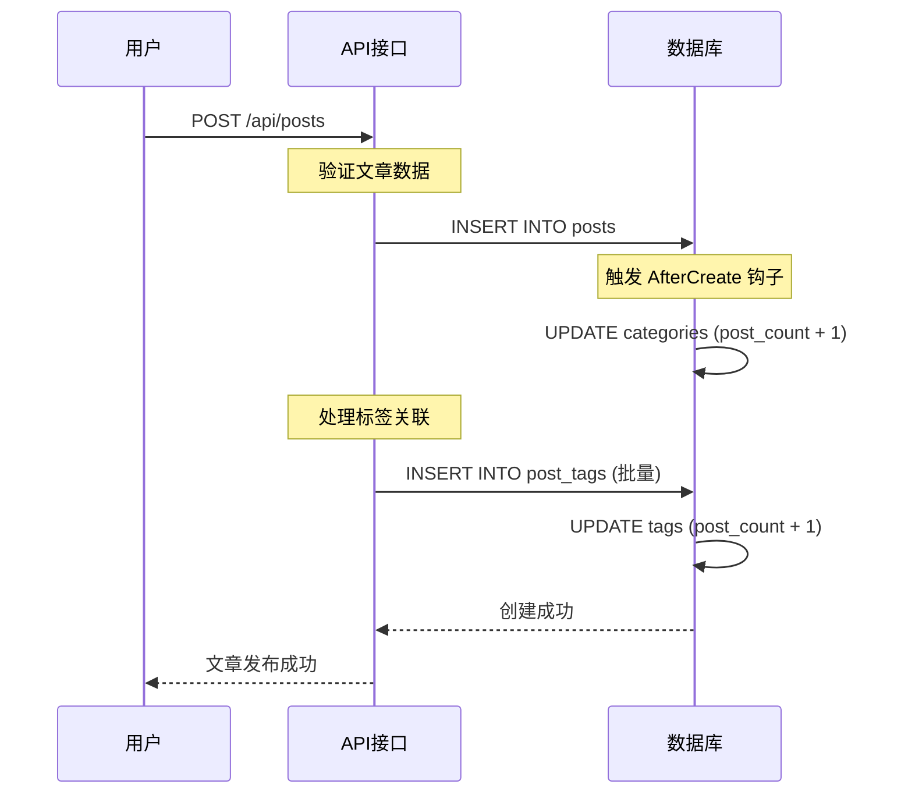
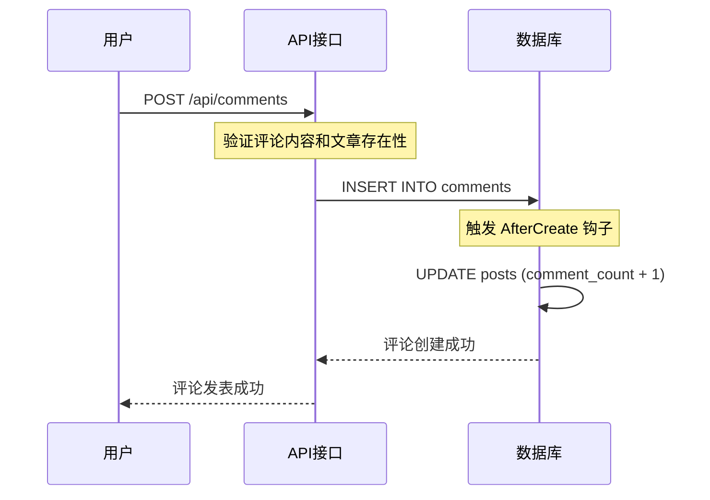
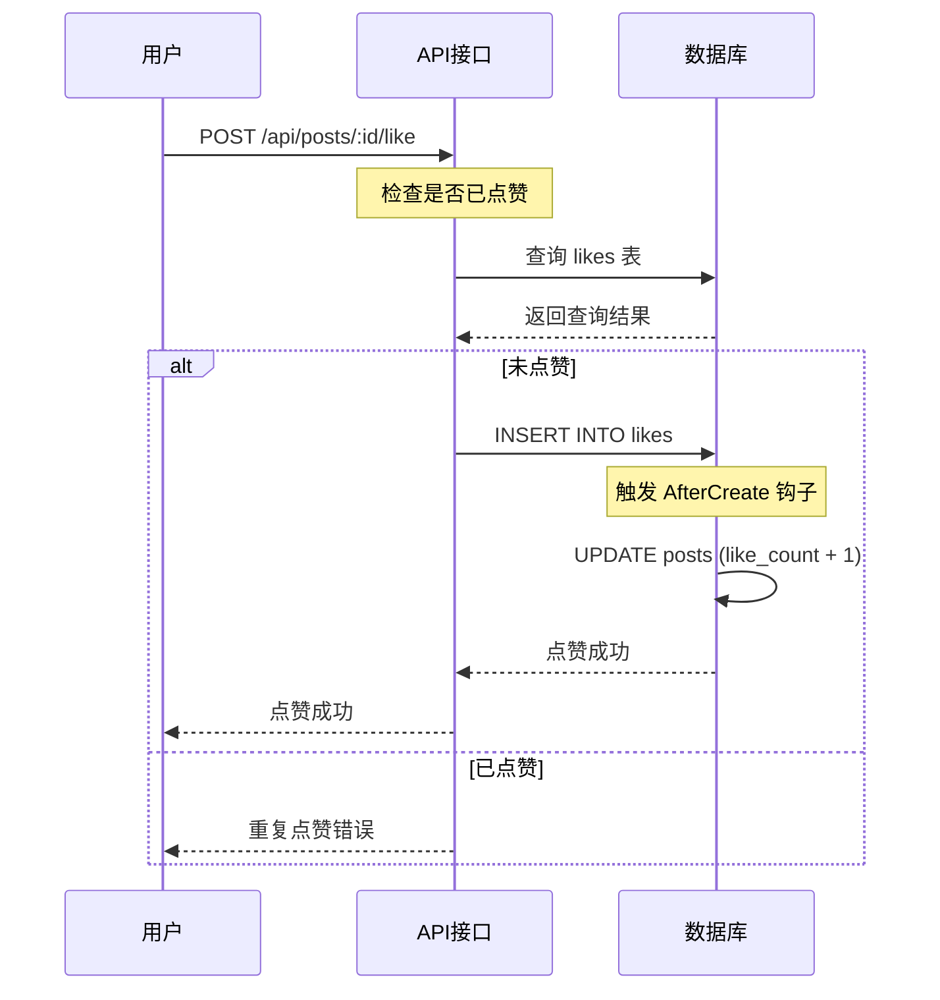
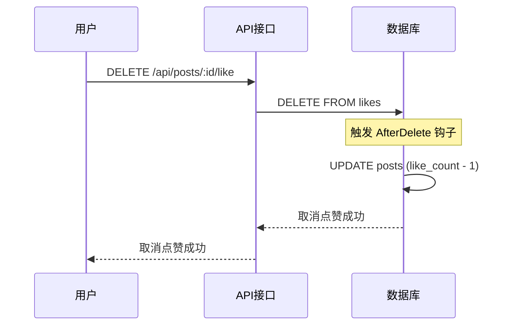
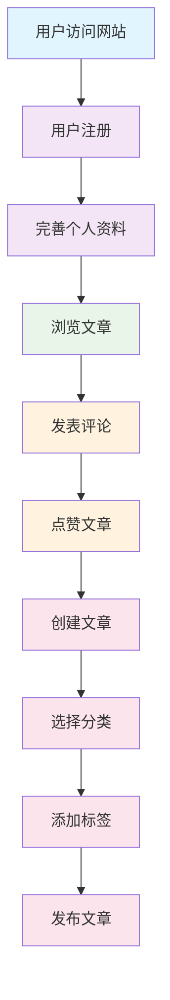
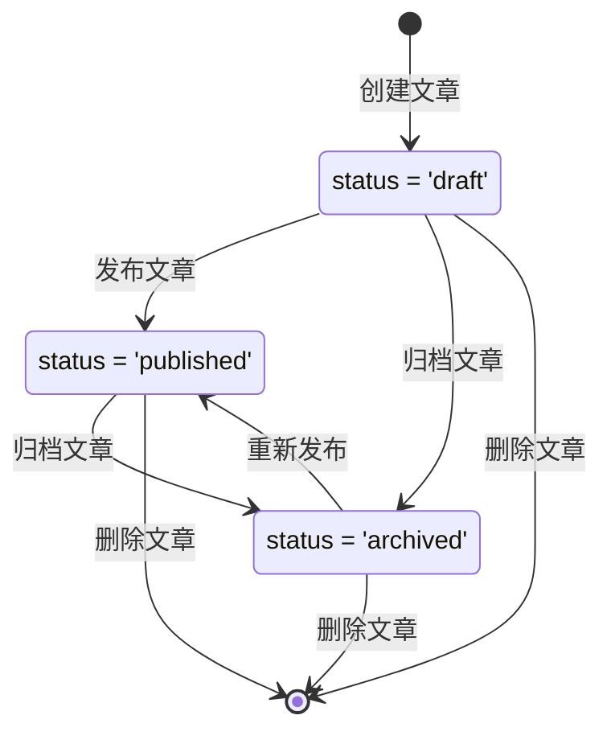

# 博客系统数据库表关系与用户操作流程分析 📊

## 📋 目录
- [数据库表结构概览](#数据库表结构概览)
- [表关系图](#表关系图)
- [详细表关系说明](#详细表关系说明)
- [用户操作流程与数据变更](#用户操作流程与数据变更)
- [核心业务场景分析](#核心业务场景分析)
- [数据完整性约束](#数据完整性约束)

---

## 🗂️ 数据库表结构概览

### 核心表结构

| 表名 | 中文名称 | 主要功能 | 关键字段 |
|------|----------|----------|----------|
| `users` | 用户表 | 存储用户基本信息 | id, username, email, password, status |
| `profiles` | 用户资料表 | 存储用户详细资料 | user_id, bio, website, location, birthday |
| `categories` | 分类表 | 文章分类管理 | id, name, slug, description, post_count |
| `tags` | 标签表 | 文章标签管理 | id, name, slug, post_count |
| `posts` | 文章表 | 存储文章内容 | id, title, content, user_id, category_id, status |
| `comments` | 评论表 | 文章评论管理 | id, content, post_id, user_id, parent_id |
| `likes` | 点赞表 | 点赞记录管理 | id, user_id, target_id, target_type |
| `post_tags` | 文章标签关联表 | 多对多关系 | post_id, tag_id |

---

## 🔗 表关系图



---

## 📝 详细表关系说明

### 1. 用户相关关系

#### 🔸 Users ↔ Profiles (一对一)
- **关系类型**: 一对一 (1:1)
- **外键**: `profiles.user_id` → `users.id`
- **约束**: CASCADE (用户删除时，资料也删除)
- **说明**: 每个用户有且仅有一个详细资料

```sql
-- 外键约束
CONSTRAINT fk_profiles_user_id 
FOREIGN KEY (user_id) REFERENCES users(id) 
ON UPDATE CASCADE ON DELETE CASCADE
```

#### 🔸 Users ↔ Posts (一对多)
- **关系类型**: 一对多 (1:N)
- **外键**: `posts.user_id` → `users.id`
- **约束**: CASCADE (用户删除时，文章也删除)
- **说明**: 一个用户可以发布多篇文章

#### 🔸 Users ↔ Comments (一对多)
- **关系类型**: 一对多 (1:N)
- **外键**: `comments.user_id` → `users.id`
- **约束**: CASCADE (用户删除时，评论也删除)
- **说明**: 一个用户可以发表多条评论

#### 🔸 Users ↔ Likes (一对多)
- **关系类型**: 一对多 (1:N)
- **外键**: `likes.user_id` → `users.id`
- **约束**: CASCADE (用户删除时，点赞记录也删除)
- **说明**: 一个用户可以点赞多个对象

### 2. 文章相关关系

#### 🔸 Categories ↔ Posts (一对多)
- **关系类型**: 一对多 (1:N)
- **外键**: `posts.category_id` → `categories.id`
- **约束**: SET NULL (分类删除时，文章的分类设为NULL)
- **说明**: 一个分类可以包含多篇文章，文章可以没有分类

#### 🔸 Posts ↔ Tags (多对多)
- **关系类型**: 多对多 (M:N)
- **中间表**: `post_tags`
- **外键**: 
  - `post_tags.post_id` → `posts.id`
  - `post_tags.tag_id` → `tags.id`
- **约束**: CASCADE (文章或标签删除时，关联记录也删除)
- **说明**: 一篇文章可以有多个标签，一个标签可以关联多篇文章

#### 🔸 Posts ↔ Comments (一对多)
- **关系类型**: 一对多 (1:N)
- **外键**: `comments.post_id` → `posts.id`
- **约束**: CASCADE (文章删除时，评论也删除)
- **说明**: 一篇文章可以有多条评论

### 3. 评论相关关系

#### 🔸 Comments ↔ Comments (自关联)
- **关系类型**: 自关联 (1:N)
- **外键**: `comments.parent_id` → `comments.id`
- **约束**: CASCADE (父评论删除时，子评论也删除)
- **说明**: 支持评论回复功能，形成树状结构

### 4. 点赞相关关系 (多态关系)

#### 🔸 Likes ↔ Posts/Comments (多态一对多)
- **关系类型**: 多态关系
- **字段**: 
  - `likes.target_id`: 目标对象ID
  - `likes.target_type`: 目标对象类型 ("post" 或 "comment")
- **约束**: 复合唯一索引防止重复点赞
- **说明**: 用户可以对文章或评论进行点赞

```sql
-- 复合唯一索引
UNIQUE INDEX idx_likes_user_target (user_id, target_id, target_type)
```

---

## 🚀 用户操作流程与数据变更

### 1. 用户注册流程 📝



**涉及表变更**:
- ✅ `users` 表: 新增用户记录
- ✅ `profiles` 表: 自动创建用户资料记录

### 2. 用户登录流程 🔐



**涉及表变更**:
- ✅ `users` 表: 更新最后登录时间和登录次数

### 3. 发布文章流程 📄



**涉及表变更**:
- ✅ `posts` 表: 新增文章记录
- ✅ `categories` 表: 更新文章数量计数
- ✅ `post_tags` 表: 新增文章标签关联
- ✅ `tags` 表: 更新标签使用计数

### 4. 发表评论流程 💬



**涉及表变更**:
- ✅ `comments` 表: 新增评论记录
- ✅ `posts` 表: 更新评论数量计数

### 5. 点赞操作流程 ❤️



**涉及表变更**:
- ✅ `likes` 表: 新增点赞记录
- ✅ `posts` 表: 更新点赞数量计数

### 6. 取消点赞流程 💔



**涉及表变更**:
- ✅ `likes` 表: 删除点赞记录
- ✅ `posts` 表: 更新点赞数量计数

---

## 🎯 核心业务场景分析

### 场景1: 用户完整使用流程



**数据变更时间线**:
1. **注册阶段**: `users` + `profiles` 表新增记录
2. **资料完善**: `profiles` 表更新
3. **浏览文章**: `posts` 表 `view_count` 增加
4. **发表评论**: `comments` 表新增 + `posts` 表 `comment_count` 增加
5. **点赞文章**: `likes` 表新增 + `posts` 表 `like_count` 增加
6. **创建文章**: `posts` 表新增 + `categories` 表 `post_count` 增加
7. **添加标签**: `post_tags` 表新增 + `tags` 表 `post_count` 增加

### 场景2: 文章生命周期



**状态变更对数据的影响**:
- **草稿 → 已发布**: `posts.status` 更新, `posts.published_at` 设置
- **发布 → 归档**: `posts.status` 更新
- **删除文章**: 级联删除 `comments`, `likes`, `post_tags` 记录

---

## 🛡️ 数据完整性约束

### 1. 主键约束
```sql
-- 所有表都有自增主键
id BIGINT UNSIGNED AUTO_INCREMENT PRIMARY KEY
```

### 2. 唯一性约束
```sql
-- 用户表
UNIQUE INDEX idx_user_username (username)
UNIQUE INDEX idx_user_email (email)

-- 分类表
UNIQUE INDEX idx_category_slug (slug)

-- 标签表
UNIQUE INDEX idx_tag_slug (slug)

-- 文章表
UNIQUE INDEX idx_post_slug (slug)

-- 点赞表 (防止重复点赞)
UNIQUE INDEX idx_likes_user_target (user_id, target_id, target_type)
```

### 3. 外键约束
```sql
-- 用户资料
CONSTRAINT fk_profiles_user_id 
FOREIGN KEY (user_id) REFERENCES users(id) 
ON UPDATE CASCADE ON DELETE CASCADE

-- 文章作者
CONSTRAINT fk_posts_user_id 
FOREIGN KEY (user_id) REFERENCES users(id) 
ON UPDATE CASCADE ON DELETE CASCADE

-- 文章分类
CONSTRAINT fk_posts_category_id 
FOREIGN KEY (category_id) REFERENCES categories(id) 
ON UPDATE CASCADE ON DELETE SET NULL

-- 评论关联
CONSTRAINT fk_comments_post_id 
FOREIGN KEY (post_id) REFERENCES posts(id) 
ON UPDATE CASCADE ON DELETE CASCADE

CONSTRAINT fk_comments_user_id 
FOREIGN KEY (user_id) REFERENCES users(id) 
ON UPDATE CASCADE ON DELETE CASCADE

-- 点赞关联
CONSTRAINT fk_likes_user_id 
FOREIGN KEY (user_id) REFERENCES users(id) 
ON UPDATE CASCADE ON DELETE CASCADE
```

### 4. 检查约束
```sql
-- 用户状态检查
CHECK (status IN ('active', 'inactive', 'banned'))

-- 文章状态检查
CHECK (status IN ('draft', 'published', 'archived'))

-- 评论状态检查
CHECK (status IN ('pending', 'approved', 'rejected'))

-- 点赞类型检查
CHECK (target_type IN ('post', 'comment'))

-- 性别检查
CHECK (gender IN ('male', 'female', 'unknown'))
```

### 5. 索引优化
```sql
-- 性能优化索引
INDEX idx_posts_status (status)
INDEX idx_posts_published_at (published_at)
INDEX idx_posts_view_count (view_count)
INDEX idx_posts_like_count (like_count)
INDEX idx_comments_status (status)
INDEX idx_users_status (status)
```

---

## 📊 总结

### 核心表关系总览
- **用户中心**: `users` ↔ `profiles` (1:1)
- **内容管理**: `users` → `posts` → `comments` (1:N:N)
- **分类体系**: `categories` → `posts` (1:N)
- **标签体系**: `tags` ↔ `posts` (M:N)
- **互动功能**: `users` → `likes` → `posts/comments` (多态)
- **评论回复**: `comments` → `comments` (自关联)

### 数据流向特点
1. **用户注册**: 自动创建用户资料
2. **文章发布**: 自动更新分类和标签计数
3. **评论发表**: 自动更新文章评论数
4. **点赞操作**: 自动更新目标对象点赞数
5. **数据删除**: 级联删除相关记录

### 系统设计亮点
- ✨ **多态关系**: 点赞系统支持文章和评论
- ✨ **自关联**: 评论支持多级回复
- ✨ **钩子函数**: 自动维护计数字段
- ✨ **软删除**: 支持数据恢复
- ✨ **约束完整**: 保证数据一致性

这个博客系统的数据库设计充分体现了关系型数据库的优势，通过合理的表关系设计和约束机制，确保了数据的完整性和一致性，同时支持复杂的业务场景和用户交互功能。🎉