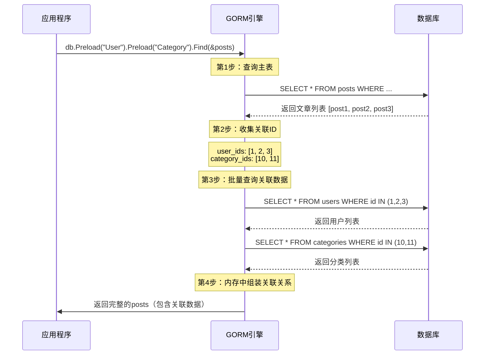

# GORM Preload 机制与性能优化详解 🚀

## 📋 目录
- [Preload 机制原理](#preload-机制原理)
- [N+1 查询问题](#n1-查询问题)
- [性能对比分析](#性能对比分析)
- [GORM 核心特性](#gorm-核心特性)
- [最佳实践建议](#最佳实践建议)
- [学习要点总结](#学习要点总结)

---

## 🔍 Preload 机制原理

### 什么是 Preload？

`Preload` 是 GORM 提供的**预加载机制**，用于解决关联数据的查询问题。它的核心思想是：

```go
// 不使用 Preload - 会产生 N+1 查询问题
var posts []models.Post
db.Find(&posts) // 1次查询获取文章
for _, post := range posts {
    fmt.Println(post.User.Email)    // 每个文章触发1次用户查询
    fmt.Println(post.Category.Name) // 每个文章触发1次分类查询
}
// 总计：1 + N*2 次查询（N为文章数量）

// 使用 Preload - 优化为固定次数查询
var posts []models.Post
db.Preload("User").Preload("Category").Find(&posts)
// 总计：3次查询（文章1次 + 用户1次 + 分类1次）
for _, post := range posts {
    fmt.Println(post.User.Email)    // 直接从内存读取，无额外查询
    fmt.Println(post.Category.Name) // 直接从内存读取，无额外查询
}
```

### 🎯 Preload 的工作流程



---

## ⚠️ N+1 查询问题

### 什么是 N+1 查询？

**N+1 查询**是 ORM 框架中最常见的性能陷阱：

```go
// ❌ 错误示例：产生 N+1 查询
func GetPostsWithN1Problem() {
    var posts []models.Post
    db.Find(&posts) // 1次查询：获取所有文章
    
    for _, post := range posts { // N次循环
        // 每次访问关联字段都会触发新的数据库查询
        fmt.Println(post.User.Email)    // +1次查询
        fmt.Println(post.Category.Name) // +1次查询
    }
    // 总查询次数：1 + N*2 = 1 + 2N
}

// ✅ 正确示例：使用 Preload 解决
func GetPostsOptimized() {
    var posts []models.Post
    db.Preload("User").Preload("Category").Find(&posts)
    // 总查询次数：3次（固定）
    
    for _, post := range posts {
        fmt.Println(post.User.Email)    // 从内存读取
        fmt.Println(post.Category.Name) // 从内存读取
    }
}
```

### 📊 查询次数对比

| 文章数量 | 不使用Preload | 使用Preload | 性能提升 |
|---------|--------------|-------------|----------|
| 10篇    | 21次查询      | 3次查询      | 7倍      |
| 100篇   | 201次查询     | 3次查询      | 67倍     |
| 1000篇  | 2001次查询    | 3次查询      | 667倍    |

---

## 🏁 性能对比分析

### 为什么多次小查询比 LEFT JOIN 更快？

你观察到的现象（多次查询比LEFT JOIN快）是正确的，原因如下：

#### 1. **数据传输量差异**

```sql
-- LEFT JOIN 方式：数据冗余严重
SELECT 
    posts.*, users.*, categories.*, tags.*
FROM posts 
LEFT JOIN users ON posts.user_id = users.id
LEFT JOIN categories ON posts.category_id = categories.id  
LEFT JOIN post_tags ON posts.id = post_tags.post_id
LEFT JOIN tags ON post_tags.tag_id = tags.id;

-- 结果：每个文章的用户和分类信息都会重复传输
-- 如果1篇文章有3个标签，用户和分类信息会重复3次
```

```sql
-- Preload 方式：数据去重
-- 查询1：SELECT * FROM posts WHERE ...
-- 查询2：SELECT * FROM users WHERE id IN (1,2,3)
-- 查询3：SELECT * FROM categories WHERE id IN (10,11)
-- 查询4：SELECT tags.*, post_tags.post_id FROM tags JOIN post_tags ...

-- 结果：每条数据只传输一次，无冗余
```

#### 2. **内存使用对比**

```go
// LEFT JOIN 内存占用示例
type JoinResult struct {
    // 文章信息（每行都有）
    PostID    uint   `json:"post_id"`
    Title     string `json:"title"`
    Content   string `json:"content"`
    
    // 用户信息（重复N次，N=标签数量）
    UserID    uint   `json:"user_id"`
    Username  string `json:"username"`
    Email     string `json:"email"`
    
    // 分类信息（重复N次）
    CategoryID   uint   `json:"category_id"`
    CategoryName string `json:"category_name"`
    
    // 标签信息
    TagID   uint   `json:"tag_id"`
    TagName string `json:"tag_name"`
}

// 如果1篇文章有5个标签，用户和分类信息会重复5次！
```

```go
// Preload 内存占用示例
type Post struct {
    ID       uint      `json:"id"`
    Title    string    `json:"title"`
    Content  string    `json:"content"`
    User     User      `json:"user"`     // 只存储一次
    Category Category  `json:"category"` // 只存储一次
    Tags     []Tag     `json:"tags"`     // 数组形式，无重复
}
```

#### 3. **数据库执行计划差异**

```sql
-- 复杂 JOIN 的执行计划
EXPLAIN QUERY PLAN 
SELECT posts.*, users.*, categories.*, tags.*
FROM posts 
LEFT JOIN users ON posts.user_id = users.id
LEFT JOIN categories ON posts.category_id = categories.id  
LEFT JOIN post_tags ON posts.id = post_tags.post_id
LEFT JOIN tags ON post_tags.tag_id = tags.id;

-- 可能的执行计划：
-- 1. 扫描 posts 表
-- 2. 对每个 post，查找对应的 user（可能使用索引）
-- 3. 对每个 post，查找对应的 category（可能使用索引）
-- 4. 对每个 post，查找所有关联的 tags（可能需要临时表）
-- 5. 合并所有结果（可能需要排序和去重）
```

```sql
-- 简单查询的执行计划
-- 查询1：SELECT * FROM posts WHERE status = 'published'
-- 执行计划：使用 status 索引，直接返回

-- 查询2：SELECT * FROM users WHERE id IN (1,2,3,4,5)
-- 执行计划：使用主键索引，批量查找

-- 查询3：SELECT * FROM categories WHERE id IN (10,11,12)
-- 执行计划：使用主键索引，批量查找
```

#### 4. **网络传输效率**

```
📊 数据传输量对比（假设10篇文章，每篇3个标签）

LEFT JOIN 方式：
┌─────────────────────────────────────┐
│ 文章1 + 用户A + 分类X + 标签1        │ ← 重复用户A和分类X
│ 文章1 + 用户A + 分类X + 标签2        │ ← 重复用户A和分类X  
│ 文章1 + 用户A + 分类X + 标签3        │ ← 重复用户A和分类X
│ 文章2 + 用户B + 分类Y + 标签4        │
│ ...                                │
└─────────────────────────────────────┘
总行数：30行（10篇 × 3标签）
数据冗余：用户和分类信息重复30次

Preload 方式：
┌─────────────────┐ ┌─────────────┐ ┌─────────────┐
│ 文章1           │ │ 用户A       │ │ 分类X       │
│ 文章2           │ │ 用户B       │ │ 分类Y       │
│ ...             │ │ ...         │ │ ...         │
│ 文章10          │ └─────────────┘ └─────────────┘
└─────────────────┘
┌─────────────────┐
│ 标签1           │
│ 标签2           │
│ ...             │
│ 标签30          │
└─────────────────┘
总行数：50行（10+10+5+25）
数据冗余：无
```

---

## 🎯 GORM 核心特性

### 1. **智能关联管理**

```go
// 🔗 关联关系定义
type User struct {
    ID       uint      `gorm:"primaryKey"`
    Username string    `gorm:"uniqueIndex"`
    Posts    []Post    `gorm:"foreignKey:UserID"` // 一对多
    Profile  Profile   `gorm:"foreignKey:UserID"` // 一对一
}

type Post struct {
    ID         uint       `gorm:"primaryKey"`
    UserID     uint       `gorm:"index"`
    User       User       `gorm:"foreignKey:UserID"` // 多对一
    Tags       []Tag      `gorm:"many2many:post_tags;"` // 多对多
    Comments   []Comment  `gorm:"foreignKey:PostID"` // 一对多
}
```

### 2. **灵活的查询构建器**

```go
// 🔍 链式查询
var posts []Post
result := db.
    Where("status = ?", "published").
    Where("created_at > ?", time.Now().AddDate(0, -1, 0)).
    Preload("User", func(db *gorm.DB) *gorm.DB {
        return db.Select("id, username, email") // 只加载需要的字段
    }).
    Preload("Tags", "status = ?", "active"). // 条件预加载
    Order("created_at DESC").
    Limit(10).
    Find(&posts)
```

### 3. **自动迁移系统**

```go
// 🔄 数据库迁移
func AutoMigrate(db *gorm.DB) error {
    return db.AutoMigrate(
        &User{},
        &Profile{},
        &Post{},
        &Category{},
        &Tag{},
        &Comment{},
    )
}

// GORM 会自动：
// 1. 创建表结构
// 2. 添加索引
// 3. 创建外键约束
// 4. 处理字段变更
```

### 4. **钩子函数系统**

```go
// 🪝 生命周期钩子
func (u *User) BeforeCreate(tx *gorm.DB) error {
    // 创建前：密码加密
    hashedPassword, err := bcrypt.GenerateFromPassword([]byte(u.Password), bcrypt.DefaultCost)
    if err != nil {
        return err
    }
    u.Password = string(hashedPassword)
    return nil
}

func (p *Post) AfterCreate(tx *gorm.DB) error {
    // 创建后：更新用户文章计数
    return tx.Model(&User{}).Where("id = ?", p.UserID).
        UpdateColumn("post_count", gorm.Expr("post_count + ?", 1)).Error
}
```

### 5. **软删除机制**

```go
// 🗑️ 软删除
type Post struct {
    ID        uint           `gorm:"primaryKey"`
    Title     string
    DeletedAt gorm.DeletedAt `gorm:"index"` // 软删除字段
}

// 删除操作
db.Delete(&post) // 实际执行：UPDATE posts SET deleted_at = NOW() WHERE id = ?

// 查询时自动过滤软删除记录
db.Find(&posts) // 实际执行：SELECT * FROM posts WHERE deleted_at IS NULL

// 查询包含软删除记录
db.Unscoped().Find(&posts) // 查询所有记录
```

### 6. **事务管理**

```go
// 💳 事务处理
func CreatePostWithTransaction(db *gorm.DB, post *Post) error {
    return db.Transaction(func(tx *gorm.DB) error {
        // 1. 创建文章
        if err := tx.Create(post).Error; err != nil {
            return err
        }
        
        // 2. 更新用户统计
        if err := tx.Model(&User{}).Where("id = ?", post.UserID).
            UpdateColumn("post_count", gorm.Expr("post_count + 1")).Error; err != nil {
            return err
        }
        
        // 3. 更新分类统计
        if err := tx.Model(&Category{}).Where("id = ?", post.CategoryID).
            UpdateColumn("post_count", gorm.Expr("post_count + 1")).Error; err != nil {
            return err
        }
        
        return nil // 提交事务
    })
}
```

---

## 💡 最佳实践建议

### 1. **选择合适的加载策略**

```go
// 🎯 根据场景选择策略

// 场景1：需要完整关联数据 → 使用 Preload
func GetPostsForDisplay() []Post {
    var posts []Post
    db.Preload("User").Preload("Category").Preload("Tags").Find(&posts)
    return posts
}

// 场景2：只需要部分字段 → 使用 Joins + Select
func GetPostsForList() []PostListItem {
    var items []PostListItem
    db.Table("posts").
        Select("posts.id, posts.title, users.username, categories.name as category_name").
        Joins("LEFT JOIN users ON posts.user_id = users.id").
        Joins("LEFT JOIN categories ON posts.category_id = categories.id").
        Find(&items)
    return items
}

// 场景3：大数据量分页 → 使用游标分页
func GetPostsWithCursor(cursor uint, limit int) []Post {
    var posts []Post
    db.Where("id > ?", cursor).Limit(limit).Find(&posts)
    return posts
}
```

### 2. **内存优化策略**

```go
// 🧠 内存使用优化

// ❌ 避免：一次性加载大量数据
func BadExample() {
    var posts []Post
    db.Preload("User").Preload("Comments").Find(&posts) // 可能加载数万条评论
}

// ✅ 推荐：分批处理
func GoodExample() {
    const batchSize = 100
    var offset int
    
    for {
        var posts []Post
        result := db.Preload("User").Offset(offset).Limit(batchSize).Find(&posts)
        if result.Error != nil {
            break
        }
        
        // 处理当前批次
        processPosts(posts)
        
        if len(posts) < batchSize {
            break // 没有更多数据
        }
        offset += batchSize
    }
}
```

### 3. **查询性能优化**

```go
// ⚡ 性能优化技巧

// 1. 使用索引
type Post struct {
    UserID     uint      `gorm:"index:idx_user_status,priority:1"`
    Status     string    `gorm:"index:idx_user_status,priority:2"`
    CreatedAt  time.Time `gorm:"index"`
}

// 2. 选择性预加载
db.Preload("User", func(db *gorm.DB) *gorm.DB {
    return db.Select("id, username, avatar") // 只加载需要的字段
}).Find(&posts)

// 3. 条件预加载
db.Preload("Comments", "status = ? AND created_at > ?", "approved", time.Now().AddDate(0, 0, -7)).Find(&posts)

// 4. 使用原生SQL处理复杂查询
var results []PostStatistics
db.Raw(`
    SELECT 
        p.id,
        p.title,
        COUNT(c.id) as comment_count,
        COUNT(l.id) as like_count
    FROM posts p
    LEFT JOIN comments c ON p.id = c.post_id
    LEFT JOIN likes l ON p.id = l.post_id
    WHERE p.status = 'published'
    GROUP BY p.id, p.title
    ORDER BY like_count DESC
    LIMIT 10
`).Scan(&results)
```

---

## 📚 学习要点总结

### 🎯 核心概念掌握

1. **ORM 映射关系**
   - 一对一 (hasOne/belongsTo)
   - 一对多 (hasMany/belongsTo)
   - 多对多 (many2many)
   - 多态关联 (polymorphic)

2. **查询优化策略**
   - Preload vs Joins 的选择
   - N+1 查询问题的识别和解决
   - 索引设计和使用
   - 分页和游标查询

3. **数据一致性**
   - 事务的正确使用
   - 钩子函数的应用
   - 软删除的处理
   - 并发控制

### 🛠️ 实践技能培养

1. **性能调优**
   ```go
   // 开启SQL日志
   db = db.Debug() // 开发环境
   
   // 监控慢查询
   db.Logger = logger.New(
       log.New(os.Stdout, "\r\n", log.LstdFlags),
       logger.Config{
           SlowThreshold: time.Second, // 慢查询阈值
           LogLevel:      logger.Warn,
       },
   )
   ```

2. **错误处理**
   ```go
   // 统一错误处理
   func HandleDBError(err error) error {
       if errors.Is(err, gorm.ErrRecordNotFound) {
           return fmt.Errorf("记录不存在")
       }
       if errors.Is(err, gorm.ErrDuplicatedKey) {
           return fmt.Errorf("数据重复")
       }
       return fmt.Errorf("数据库操作失败: %w", err)
   }
   ```

3. **测试编写**
   ```go
   // 数据库测试
   func TestCreatePost(t *testing.T) {
       db := setupTestDB()
       defer cleanupTestDB(db)
       
       post := &Post{Title: "测试文章"}
       err := db.Create(post).Error
       assert.NoError(t, err)
       assert.NotZero(t, post.ID)
   }
   ```

### 🚀 进阶学习方向

1. **微服务架构中的 GORM**
   - 数据库分片
   - 读写分离
   - 分布式事务

2. **性能监控和优化**
   - SQL 执行计划分析
   - 连接池调优
   - 缓存策略设计

3. **企业级应用**
   - 数据迁移策略
   - 版本控制
   - 灾备方案

---

## 🎉 总结

GORM 的 Preload 机制通过**智能的批量查询**解决了 N+1 查询问题，虽然看起来执行了多次查询，但实际上：

1. **查询次数固定**：不随数据量增长而增加
2. **数据传输优化**：避免了 JOIN 查询的数据冗余
3. **内存使用高效**：结构化存储，无重复数据
4. **执行计划简单**：每个查询都能充分利用索引

这就是为什么在你的测试中，多次小查询比复杂的 LEFT JOIN 更快的原因！🎯

GORM 作为 Go 生态中最成熟的 ORM 框架，值得深入学习的不仅是其 API 使用，更重要的是理解其背后的设计思想和性能优化策略。掌握这些知识，将帮助你构建高性能、可维护的数据库应用！✨